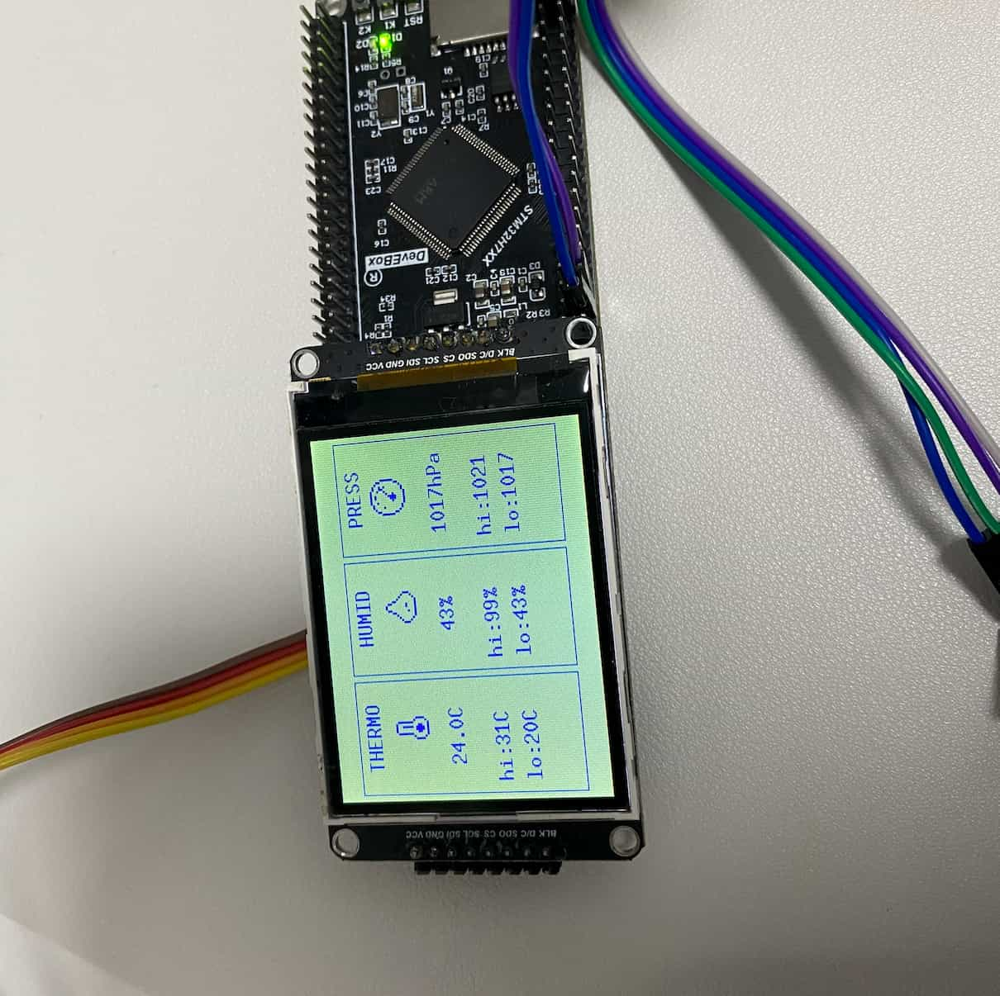

# STM32H750 Drivers

使用 Rust 编写的 STM32H750 单片机驱动集合，包含显示屏驱动（ILI9341）、多种传感器驱动（AHT20、BMP280、DHT11、RC522 RFID）和 UI 组件库。

## 示例展示



## 功能特性

- **实时监测**：定期读取 AHT20 温湿度传感器和 BMP280 气压传感器数据
- **可视化显示**：温度、湿度、气压分别以卡片形式在 ILI9341 屏幕上展示
- **状态指示**：LED 闪烁表示系统正常运行
- **高性能**：使用 DMA 和帧缓冲实现流畅显示
- **预留扩展**：包含 DHT11、RC522 RFID、NTC 等传感器驱动

## 硬件规格

| 项目 | 规格 |
|------|------|
| 主控芯片 | STM32H750VB |
| 系统时钟 | 400 MHz |
| 屏幕驱动 | ILI9341 |
| 分辨率 | 240x320 (横屏 320x240) |
| 颜色深度 | 16位 RGB565 |
| SPI 时钟 | 80 MHz |

## 硬件连接

### I2C 传感器 (PB6/PB7)

| 传感器 | 引脚 | 连接 | 说明 |
|--------|------|------|------|
| AHT20 | PB7 | SDA | I2C 数据线 |
| AHT20 | PB8 | SCL | I2C 时钟线 |
| BMP280 | PB7 | SDA | I2C 数据线（共享）|
| BMP280 | PB8 | SCL | I2C 时钟线（共享）|

### ILI9341 TFT 屏幕 (SPI2)

| STM32H750 引脚 | 功能 | ILI9341 引脚 |
|---------------|------|-------------|
| PB15 | MOSI | SPI 数据输出 |
| PB13 | SCK | SPI 时钟 |
| PB12 | CS | 片选 |
| PB14 | MISO | SPI 数据输入 |
| PB1 | DC | 数据/命令选择 |
| PB0 | BLK | 背光控制 |

### LED 状态指示

| 引脚 | 说明 |
|------|------|
| PA1 | 状态 LED（读取成功时闪烁）|

## 快速开始

### 前置要求

- Rust 工具链 (target: `thumbv7em-none-eabihf`)
- ST-Link V2/V3 调试器
- OpenOCD 工具

### 安装目标

```bash
rustup target add thumbv7em-none-eabihf
```

### 编译

```bash
make build
# 或
cargo build --release
```

### 烧录

```bash
make flash
```

### GDB 调试

```bash
# 终端 1: 启动 OpenOCD 服务器
make debug

# 终端 2: 连接 GDB
arm-none-eabi-gdb target/thumbv7em-none-eabihf/release/stm32h750-drivers
(gdb) target remote :3333
(gdb) load
(gdb) break main
(gdb) continue
```

## 项目结构

```
src/
├── main.rs              # 主程序入口
├── profiler.rs          # 性能检测模块（可选）
├── drivers/
│   ├── aht20.rs         # AHT20 温湿度传感器
│   ├── bmp280.rs        # BMP280 气压传感器
│   ├── display.rs       # ILI9341 屏幕驱动
│   ├── dht11.rs         # DHT11 温湿度传感器
│   ├── rc522.rs         # RC522 RFID 读卡器
│   ├── adc_ntc.rs       # NTC 预留驱动
│   └── serial.rs        # 串口通信
└── ui/
    ├── screen.rs        # 屏幕容器
    ├── widgets/         # UI 控件
    │   ├── card.rs      # 温湿度卡片
    │   ├── pressure_card.rs # 气压卡片
    │   ├── label.rs     # 标签
    │   └── ...          # 其他预留控件
    └── theme.rs         # 主题配置
```

## 技术实现

### 帧缓冲机制

使用帧缓冲实现高效显示：

1. **内存布局**：240×320×2 字节 ≈ 150KB (AXISRAM)
2. **绘图流程**：在内存中绘制 → DMA 批量传输 → 屏幕显示
3. **性能**：约 10fps 全屏刷新

### 传感器轮询

- 每 5 秒读取一次传感器数据
- AHT20 和 BMP280 共享 I2C 总线
- 自动处理传感器初始化失败的情况

## 开发文档

### 架构文档

- [架构设计](docs/ARCHITECTURE.md) - 系统整体架构
- [帧缓冲指南](docs/learning/FRAME_BUFFER_GUIDE.md) - 帧缓冲实现原理
- [硬件连接](docs/learning/HARDWARE_CONNECTION.md) - 详细硬件连接说明

### 问题排查

- [疑难问题必看](docs/troubleshootings/) - 常见问题解决方案
  - [字符编码问题](docs/troubleshootings/CHARACTER_ENCODING_ISSUE.md)
  - [显示驱动问题](docs/troubleshootings/DISPLAY_DRIVER.md)
  - [延时和 I2C 问题](docs/troubleshootings/STM32H750_DELAY_AND_I2C_ISSUES.md)
  - [RC522 SPI 通信问题记录](docs/troubleshootings/RC522_SPI_NOTES.md)

## 性能优化

- 使用 DMA 传输减少 CPU 占用
- 帧缓冲避免频繁 SPI 通信
- 优化传感器读取间隔

## 许可证

MIT License

## 参考资料

- [ILI9341 数据手册](https://cdn-shop.adafruit.com/datasheets/ILI9341.pdf)
- [STM32H7 参考手册](https://www.st.com/resource/en/reference_manual/dm00176879.pdf)
- [embedded-graphics 文档](https://docs.rs/embedded-graphics/)
