# 从零开始理解帧缓冲：屏幕驱动的进化之路

> 本文写给完全不懂屏幕驱动的小白，从最基础的概念开始，一步步讲解如何从"边画边传"进化到"完整帧缓冲"架构。

---

## 目录

1. [基础概念：什么是屏幕显示](#1-基础概念什么是屏幕显示)
2. [问题：为什么要用帧缓冲](#2-问题为什么要用帧缓冲)
3. [旧方案：双缓冲循环传输](#3-旧方案双缓冲循环传输)
4. [新方案：完整帧缓冲](#4-新方案完整帧缓冲)
5. [内存布局详解](#5-内存布局详解)
6. [代码实现详解](#6-代码实现详解)
7. [性能对比](#7-性能对比)
8. [常见问题](#8-常见问题)

---

## 1. 基础概念：什么是屏幕显示

### 1.1 屏幕是怎么显示图像的？

想象你在用**彩色贴纸**装饰一个墙壁：

```
┌─────────────────────────────────────┐
│                                     │
│   240 个贴纸 ───▶                   │
│   ↓                                  │
│   ┌──┬──┬──┬──┬──┬──┬── ... ───┐    │
│ ├──┼──┼──┼──┼──┼──┼──┼── ... ┼┤   │ 320 行
│ ├──┼──┼──┼──┼──┼──┼──┼── ... ┼┤   │
│ ├──┼──┼──┼──┼──┼──┼──┼── ... ┼┤   │
│ └──┴──┴──┴──┴──┴──┴──┴── ... ───┘    │
│                                     │
└─────────────────────────────────────┘
```

- **每个小格子** = 一个像素（Pixel）
- **240 × 320** = 76,800 个像素
- **每个像素** = 一种颜色（RGB565 格式，16 位 = 2 字节）
- **全屏数据** = 76,800 × 2 = **153,600 字节 = 150 KB**

### 1.2 ILI9341 屏幕控制器的工作原理

ILI9341 是一个**智能芯片**，它有自己的内存（GRAM）：

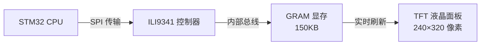

**关键点**：
- 你不是直接控制液晶面板
- 你是通过 SPI 给 ILI9341 发送数据
- ILI9341 把数据存到自己的 GRAM 里
- ILI9341 自动把 GRAM 的内容显示到屏幕上

### 1.3 RGB565 颜色格式

每个像素用 **16 位**（2 字节）表示：

```
┌─────────────────────────────────────┐
│  R4 R3 R2 R1 R0  G5 G4 G3 G2 G1 G0 │
│  ←----- 5 bit -----→ ←-- 6 bit --→ │
│         红色              绿色       │
└─────────────────────────────────────┘

┌─────────────────────────────────────┐
│  B4 B3 B2 B1 B0  X  X  X  X  X  X  │
│  ←----- 5 bit -----→               │
│         蓝色                         │
└─────────────────────────────────────┘
```

**例子**：
- 红色 (255, 0, 0) → `0xF800` → `[0xF8, 0x00]`
- 白色 (255, 255, 255) → `0xFFFF` → `[0xFF, 0xFF]`
- 黑色 (0, 0, 0) → `0x0000` → `[0x00, 0x00]`

---

## 2. 问题：为什么要用帧缓冲

### 2.1 最初的笨办法：直接传输

最早的代码是这样的：

```rust
// 想在屏幕上画一个按钮
fn draw_button() {
    for y in 0..40 {
        for x in 0..90 {
            // 每画一个像素就发送一次 SPI
            send_pixel(x, y, color);  // ← 这非常慢！
        }
    }
}
```

**问题**：
- 画一个按钮 = 发送 3,600 次 SPI
- 每次 SPI 传输都有开销（准备、发送、等待）
- CPU 大部分时间在等待 SPI 传输

### 2.2 第一次优化：批量传输

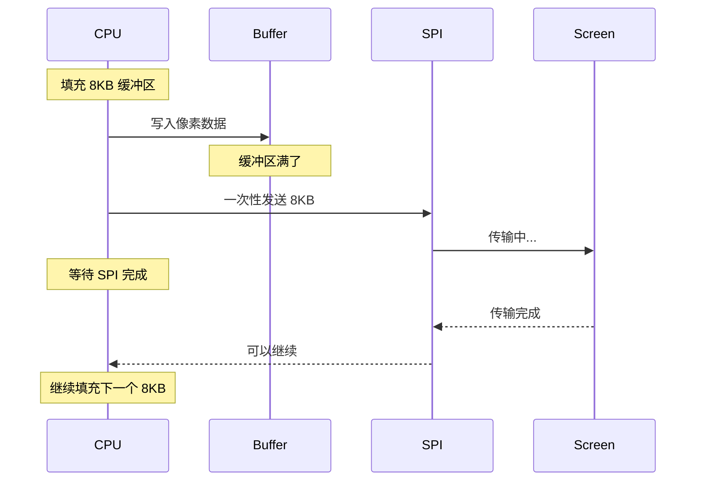

但还有问题：**绘制和传输是串行的**

```mermaid
gantt
    title 串行方式的时间线
    dateFormat X
    axisFormat %L

    section CPU
    填充缓冲区   :a1, 0, 2L
    等待SPI传输  :a2, after a1, 3L
    填充缓冲区   :a3, after a2, 2L
    等待SPI传输  :a4, after a3, 3L

    section SPI
    传输中       :b1, after a1, 3L
    空闲         :b2, after b1, 2L
    传输中       :b3, after b2, 3L
```

CPU 在等待 SPI 传输时，什么也做不了！

### 2.3 解决方案：帧缓冲

**核心思想**：把"绘制"和"传输"彻底分开

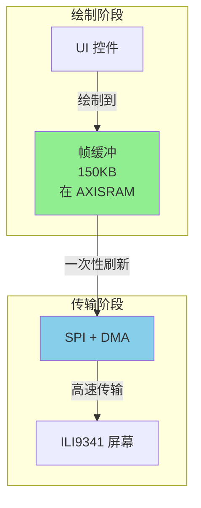

**好处**：
1. **绘制很快** - 只是写内存，不涉及 SPI
2. **可以累积** - 画多个控件后再一次性刷新
3. **局部刷新** - 只传输变化的部分

---

## 3. 旧方案：双缓冲循环传输

### 3.1 架构图

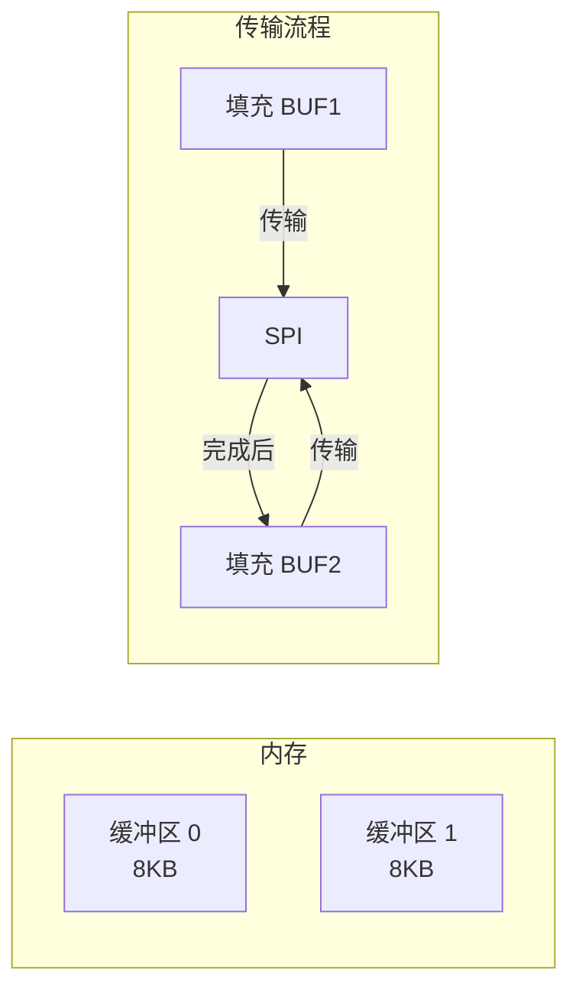

### 3.2 代码流程

```rust
// 旧代码：填充 8KB 缓冲区，循环传输
pub fn fill_rect(&mut self, x: u16, y: u16, w: u16, h: u16, color: u16) {
    let total_bytes = (w * h * 2) as usize;

    // 1. 准备 DMA 传输
    self.prepare_dma_transfer(x, y, x+w-1, y+h-1);

    // 2. 填充 8KB 缓冲区
    let buf = unsafe { (*core::ptr::addr_of_mut!(DMA_BUF0)).assume_init_mut() };
    fill_dma_buffer_partial(buf, color, DMA_BUF_SIZE.min(total_bytes));

    // 3. 循环传输
    let bytes_per_buf = DMA_BUF_SIZE;
    let full_buffers = total_bytes / bytes_per_buf;  // 需要传多少次？

    for _ in 0..full_buffers {
        while spi.inner().sr.read().txp().bit_is_clear() {}  // 等待就绪
        let _ = spi.transfer(&mut buf[..bytes_per_buf]);    // 传输
    }

    // 4. 传输剩余部分
    if remainder > 0 {
        while spi.inner().sr.read().txp().bit_is_clear() {}
        let _ = spi.transfer(&mut buf[..remainder]);
    }
}
```

### 3.3 问题分析

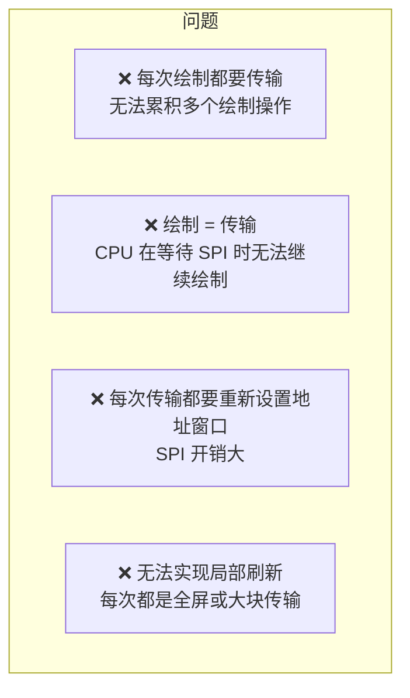

**例子**：画一个有 3 个按钮的界面

```rust
// 旧方式：每次都传输
button1.draw(&mut display);   // ← 传输 8KB+
button2.draw(&mut display);   // ← 传输 8KB+
button3.draw(&mut display);   // ← 传输 8KB+

// 总计：3 次 SPI 传输，大量等待时间
```

---

## 4. 新方案：完整帧缓冲

### 4.1 架构图

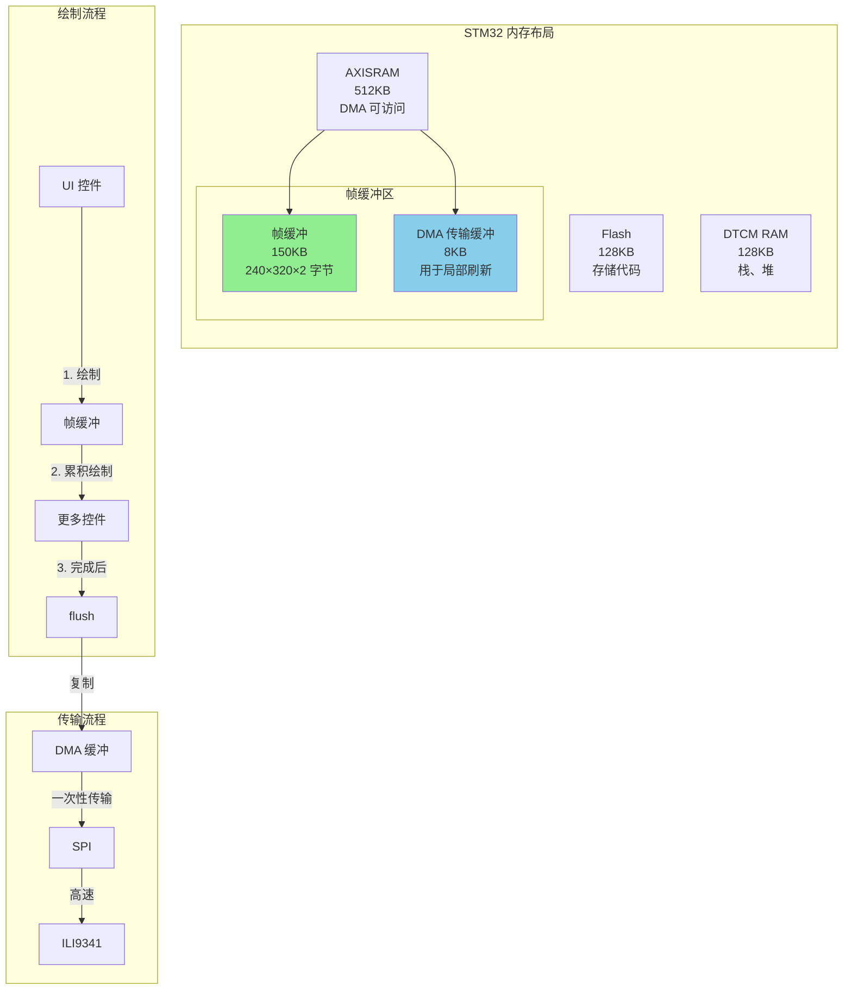

### 4.2 新的绘制流程

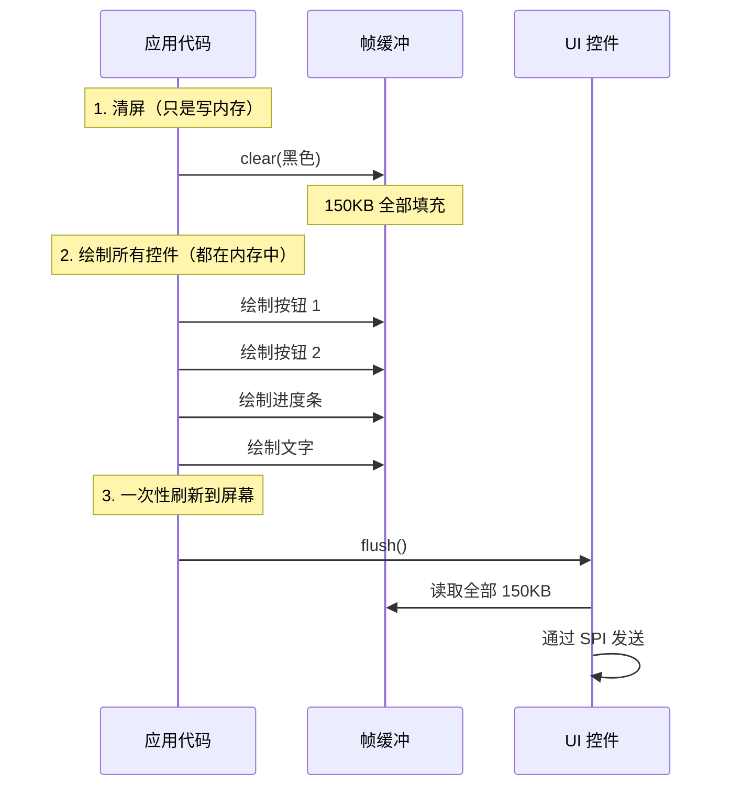

### 4.3 时间线对比

```mermaid
gantt
    title 新方式：绘制与传输分离
    dateFormat X
    axisFormat %L

    section CPU 绘制
    清屏         :a1, 0, 1L
    画按钮1      :a2, after a1, 1L
    画按钮2      :a3, after a2, 1L
    画进度条     :a4, after a3, 1L
    画文字       :a5, after a4, 1L
    调用flush    :a6, after a5, 1L

    section SPI 传输
    空闲         :b1, 0, 6L
    传输150KB    :b2, after a5, 10L
```

**关键变化**：
- CPU 连续绘制，不等待 SPI
- 绘制完成后，一次性传输所有数据
- 总时间更短！

---

## 5. 内存布局详解

### 5.1 STM32H750 内存地图

```
┌─────────────────────────────────────────────────────────┐
│  STM32H750VB 芯片内存                                    │
├─────────────────────────────────────────────────────────┤
│                                                         │
│  0x0800_0000 ───▶  ┌──────────────────────┐            │
│                    │  Flash (128KB)       │            │
│                    │  - 存储代码           │            │
│                    └──────────────────────┘            │
│                                                         │
│  0x2000_0000 ───▶  ┌──────────────────────┐            │
│                    │  DTCM RAM (128KB)    │            │
│                    │  - 栈                 │            │
│                    │  - 堆                 │            │
│                    │  - 静态变量           │            │
│                    │  ⚠️ DMA 无法访问！    │            │
│                    └──────────────────────┘            │
│                                                         │
│  0x2400_0000 ───▶  ┌──────────────────────┐            │
│                    │  AXISRAM (512KB)     │ ← DMA 可访问│
│                    │  ┌────────────────┐  │            │
│                    │  │ 帧缓冲 150KB   │  │            │
│                    │  │ (240×320×2)    │  │            │
│                    │  ├────────────────┤  │            │
│                    │  │ DMA 缓冲 8KB   │  │            │
│                    │  └────────────────┘  │            │
│                    │  ┌────────────────┐  │            │
│                    │  │ 剩余 354KB     │  │            │
│                    │  │ (可用于其他)   │  │            │
│                    │  └────────────────┘  │            │
│                    └──────────────────────┘            │
│                                                         │
└─────────────────────────────────────────────────────────┘
```

### 5.2 为什么必须是 AXISRAM？

**STM32H7 的 DMA 限制**：

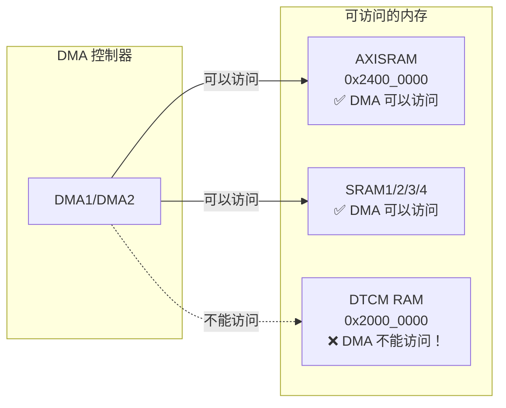

**原因**：STM32H7 的总线架构
- DTCM (Data Tightly Coupled Memory) 直接连接到 CPU 核心
- 为了最快的访问速度，不经过系统总线
- DMA 控制器连接到系统总线，无法访问 DTCM

### 5.3 链接脚本配置

在 `memory.x` 文件中定义 AXISRAM 段：

```toml
MEMORY {
    FLASH   : ORIGIN = 0x08000000, LENGTH = 128K
    RAM     : ORIGIN = 0x20000000, LENGTH = 128K
    AXISRAM : ORIGIN = 0x24000000, LENGTH = 512K
}

_stack_start = ORIGIN(RAM) + LENGTH(RAM);

/* 定义 AXISRAM 段 */
SECTIONS {
    .axisram (NOLOAD) : ALIGN(8) {
        *(.axisram .axisram.*);
        . = ALIGN(8);
    } > AXISRAM
};
```

**关键点**：
- `NOLOAD`：防止数据被包含在二进制文件中（150KB 会让固件文件变得很大）
- `ALIGN(8)`：8 字节对齐，DMA 传输效率更高

### 5.4 Rust 代码中指定段

```rust
/// 完整帧缓冲（AXISRAM 中，150KB）
#[link_section = ".axisram.buffers"]  // ← 关键！指定放在 AXISRAM
static mut FRAME_BUFFER: MaybeUninit<[u16; FRAME_BUFFER_SIZE]> = MaybeUninit::uninit();

/// DMA 传输缓冲区（AXISRAM 中，8KB）
#[link_section = ".axisram.buffers"]
static mut DMA_BUF: MaybeUninit<[u8; DMA_BUF_SIZE]> = MaybeUninit::uninit();
```

---

## 6. 代码实现详解

### 6.1 帧缓冲定义

```rust
/// 屏幕分辨率
pub const DISPLAY_WIDTH: usize = 240;
pub const DISPLAY_HEIGHT: usize = 320;

/// 完整帧缓冲大小（像素数）
pub const FRAME_BUFFER_SIZE: usize = DISPLAY_WIDTH * DISPLAY_HEIGHT;
// 240 * 320 = 76,800 个像素

/// DMA 传输缓冲区大小（字节）
pub const DMA_BUF_SIZE: usize = 8192;
// 8KB = 4,096 个像素

/// 完整帧缓冲（AXISRAM 中，150KB）
#[link_section = ".axisram.buffers"]
static mut FRAME_BUFFER: MaybeUninit<[u16; FRAME_BUFFER_SIZE]> = MaybeUninit::uninit();
```

**为什么用 `MaybeUninit`？**

```rust
// ❌ 错误方式
static mut FRAME_BUFFER: [u16; FRAME_BUFFER_SIZE] = [0; FRAME_BUFFER_SIZE];
// 编译器会在程序启动时尝试初始化这个大数组
// 这会花费大量时间，甚至导致栈溢出

// ✅ 正确方式
static mut FRAME_BUFFER: MaybeUninit<[u16; FRAME_BUFFER_SIZE]> = MaybeUninit::uninit();
// 只是分配内存，不初始化
// 我们在 init_frame_buffer() 函数中手动初始化
```

### 6.2 初始化帧缓冲

```rust
/// 初始化帧缓冲（必须在 main 中调用一次）
pub fn init_frame_buffer() {
    unsafe {
        // 1. 获取可变引用
        let fb = (*core::ptr::addr_of_mut!(FRAME_BUFFER)).assume_init_mut();

        // 2. 填充为黑色（所有像素 = 0）
        fb.fill(0);

        // 3. 初始化 DMA 传输缓冲区
        let dma_buf = (*core::ptr::addr_of_mut!(DMA_BUF)).assume_init_mut();
        dma_buf.fill(0);
    }
}
```

**在 main.rs 中调用**：

```rust
#[entry]
fn main() -> ! {
    // ... 初始化 SPI 等 ...

    // ⚠️ 必须在第一次使用 display 之前调用！
    init_frame_buffer();

    // 现在可以安全使用 display 了
    let mut display = DisplayDriver::new(spi, disp_cs, disp_dc);
    display.init(&mut delay_ms);
}
```

### 6.3 DrawTarget 实现：绘制到帧缓冲

```rust
impl DrawTarget for DisplayDriver {
    type Color = Rgb565;
    type Error = core::convert::Infallible;

    fn draw_iter<I>(&mut self, pixels: I) -> Result<(), Self::Error>
    where
        I: IntoIterator<Item = Pixel<Self::Color>>,
    {
        // 1. 获取帧缓冲的可变引用
        let framebuffer = unsafe {
            (*core::ptr::addr_of_mut!(FRAME_BUFFER)).assume_init_mut()
        };

        // 2. 遍历所有像素，直接写入帧缓冲
        for Pixel(point, color) in pixels {
            let x = point.x as usize;
            let y = point.y as usize;

            // 边界检查
            if x < DISPLAY_WIDTH && y < DISPLAY_HEIGHT {
                // 计算索引：y * width + x
                let idx = y * DISPLAY_WIDTH + x;
                framebuffer[idx] = color.into_storage();
                // ↑ 只是写内存，非常快！
            }
        }

        Ok(())
    }
}
```

**关键点**：
- ✅ **不涉及 SPI** - 只是写内存
- ✅ **不会阻塞** - CPU 不需要等待
- ✅ **可以累积** - 多次绘制后再 flush

### 6.4 全屏刷新：flush()

```rust
/// 全屏刷新（将帧缓冲发送到屏幕）
pub fn flush(&mut self) {
    let framebuffer = unsafe {
        (*core::ptr::addr_of_mut!(FRAME_BUFFER)).assume_init_mut()
    };

    // 1. 准备全屏传输：设置地址窗口
    self.prepare_dma_transfer(
        0, 0,
        (DISPLAY_WIDTH - 1) as u16,
        (DISPLAY_HEIGHT - 1) as u16,
    );

    let mut spi = self.take_spi().unwrap();
    let dma_buf = unsafe {
        (*core::ptr::addr_of_mut!(DMA_BUF)).assume_init_mut()
    };

    // 2. 计算传输参数
    let total_pixels = FRAME_BUFFER_SIZE;        // 76,800 像素
    let pixels_per_transfer = DMA_BUF_SIZE / 2;  // 8KB / 2 = 4,096 像素
    let mut pixel_offset = 0;

    // 3. 循环传输整个帧缓冲
    while pixel_offset < total_pixels {
        let remaining = total_pixels - pixel_offset;
        let count = remaining.min(pixels_per_transfer);

        // 3.1 从帧缓冲复制到 DMA 缓冲区
        //     u16 → 转换为字节 → u8 数组
        for i in 0..count {
            let pixel = framebuffer[pixel_offset + i];
            dma_buf[i * 2] = (pixel >> 8) as u8;     // 高字节
            dma_buf[i * 2 + 1] = (pixel & 0xFF) as u8;  // 低字节
        }

        // 3.2 等待 SPI 就绪
        while spi.inner().sr.read().txp().bit_is_clear() {}

        // 3.3 通过 SPI 传输
        let _ = spi.transfer(&mut dma_buf[..count * 2]);

        pixel_offset += count;
    }

    // 4. 等待传输完成
    while spi.inner().sr.read().txc().bit_is_clear() {}

    self.put_spi(spi);
    self.end_dma_transfer();
}
```

**流程图**：

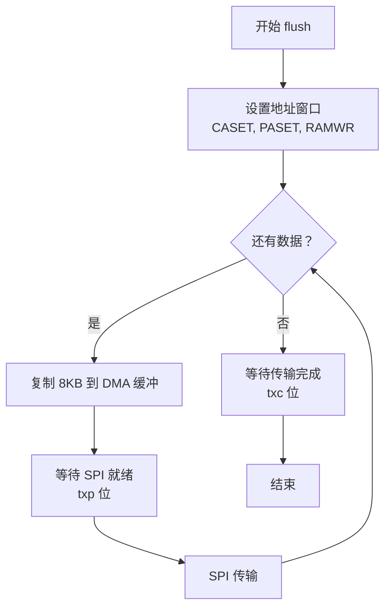

### 6.5 局部刷新：flush_rect()

```rust
/// 区域刷新（脏矩形优化）
pub fn flush_rect(&mut self, x: u16, y: u16, w: u16, h: u16) {
    // 1. 边界检查
    if x >= DISPLAY_WIDTH as u16 || y >= DISPLAY_HEIGHT as u16 {
        return;
    }

    let x1 = (x + w.saturating_sub(1)).min((DISPLAY_WIDTH - 1) as u16);
    let y1 = (y + h.saturating_sub(1)).min((DISPLAY_HEIGHT - 1) as u16);
    let width = (x1 - x + 1) as usize;
    let height = (y1 - y + 1) as usize;

    // 2. 准备区域传输
    self.prepare_dma_transfer(x, y, x1, y1);
    let mut spi = self.take_spi().unwrap();

    // 3. 逐行传输
    for row in 0..height {
        let y = y as usize + row;
        let mut col_offset = 0;

        while col_offset < width {
            let count = (width - col_offset).min(DMA_BUF_SIZE / 2);

            // 从帧缓冲复制当前行的一段
            for i in 0..count {
                let x = x as usize + col_offset + i;
                let pixel = framebuffer[y * DISPLAY_WIDTH + x];
                dma_buf[i * 2] = (pixel >> 8) as u8;
                dma_buf[i * 2 + 1] = (pixel & 0xFF) as u8;
            }

            // 传输
            while spi.inner().sr.read().txp().bit_is_clear() {}
            let _ = spi.transfer(&mut dma_buf[..count * 2]);

            col_offset += count;
        }
    }

    // 4. 等待完成
    while spi.inner().sr.read().txc().bit_is_clear() {}
    self.put_spi(spi);
    self.end_dma_transfer();
}
```

**局部刷新示意图**：

```
┌─────────────────────────────────────┐
│                                     │
│   全屏: 240 × 320 = 76,800 像素     │
│                                     │
│   ┌─────────────────────┐           │
│   │                     │           │
│   │   只刷新这个小区域   │ ← 优！     │
│   │   200 × 25 = 5,000  │           │
│   │   像素               │           │
│   │                     │           │
│   └─────────────────────┘           │
│                                     │
└─────────────────────────────────────┘

节省: 76,800 - 5,000 = 71,800 像素 (93% 减少！)
```

### 6.6 UI 更新示例

```rust
// 旧方式：每次绘制都传输
screen.draw_with_dma(&mut display)?;  // ← 每次都全屏传输

// 新方式：累积绘制，最后一次性刷新
display.clear(Rgb565::BLACK)?;
title.draw(&mut display)?;
button1.draw(&mut display)?;
button2.draw(&mut display)?;
progress.draw(&mut display)?;
display.flush();  // ← 只在这里传输一次

// 局部更新：只刷新进度条
progress.set_value(50);
progress.draw(&mut display)?;
display.flush_rect(20, 130, 200, 25);  // ← 只传输进度条区域
```

---

## 7. 性能对比

### 7.1 时间对比

| 操作 | 旧方案 | 新方案 | 提升 |
|------|--------|--------|------|
| 清屏 | ~50ms | ~1ms (写内存) + ~10ms (flush) | **4x** |
| 画按钮 | ~20ms | ~0.5ms (写内存) | **40x** |
| 全屏刷新 | N/A | ~10ms | 新功能 |
| 局部刷新 | N/A | ~2ms (进度条) | 新功能 |

### 7.2 数据传输对比

**清屏操作**：

```
旧方案：
├─ 填充 8KB 缓冲区
├─ 传输 8KB
├─ 填充 8KB 缓冲区
├─ 传输 8KB
├─ ... (重复 19 次)
└─ 传输最后的 4KB
总计: 19 次完整传输 + 1 次部分传输

新方案：
├─ 填充帧缓冲 150KB (内存操作，超快)
└─ flush() → 传输 150KB
总计: 1 次设置地址窗口 + 多次 8KB 传输
```

### 7.3 CPU 使用率对比

```mermaid
gantt
    title CPU 使用率对比（绘制一个按钮）
    dateFormat X
    axisFormat %L

    section 旧方案
    填充缓冲区  :a1, 0, 1L
    等待SPI    :crit, a2, after a1, 3L
    填充缓冲区  :a3, after a2, 1L
    等待SPI    :crit, a4, after a3, 3L
    填充缓冲区  :a5, after a4, 1L
    等待SPI    :crit, a6, after a5, 2L

    section 新方案
    写帧缓冲    :b1, 0, 1L
    CPU空闲     :b2, after b1, 4L
```

**关键差异**：
- 旧方案：CPU 大部分时间在等待 SPI
- 新方案：CPU 写完帧缓冲后可以去做别的事

---

## 8. 常见问题

### Q1: 为什么不用 DMA 自动传输？

**问题**：既然有 DMA，为什么不能让 DMA 自动从帧缓冲传输到屏幕？

**答案**：可以，但需要更复杂的配置。

当前方案是**软件控制的 DMA 传输**：

```rust
// 软件控制：CPU 复制数据，然后启动 DMA
for i in 0..count {
    dma_buf[i] = framebuffer[offset + i];
}
spi.transfer(&mut dma_buf[..count]);  // ← 使用 DMA
```

**真正的硬件 DMA**（未实现）会是这样：

```rust
// 硬件 DMA：直接从帧缓冲传输到 SPI
dma1.transfer_memory_to_spi(
    &framebuffer,  // 源：帧缓冲
    spi,           // 目标：SPI
    length,        // 长度
);
// CPU 可以去做别的事，DMA 完成后触发中断
```

这需要：
1. 配置 DMA 源地址 = 帧缓冲地址
2. 配置 DMA 目标 = SPI 数据寄存器
3. 处理 DMA 完成中断
4. 确保 DMA 可以访问帧缓冲（已经在 AXISRAM 中 ✅）

### Q2: 150KB 的帧缓冲会不会太大？

**分析**：

```
AXISRAM 总容量: 512KB
帧缓冲占用:      150KB (29%)
DMA 缓冲:        8KB (1.5%)
剩余可用:        354KB (69.5%)
```

**结论**：完全足够！

如果你的程序需要更多内存：
- 可以考虑 RGB888 (24 位色) → 225KB
- 或者双缓冲 (前台 + 后台) → 300KB
- 都还在 512KB 范围内

### Q3: 为什么不用堆（heap）分配帧缓冲？

```rust
// ❌ 不推荐
let mut framebuffer: Box<[u16; FRAME_BUFFER_SIZE]> =
    Box::new([0; FRAME_BUFFER_SIZE]);

// ✅ 推荐
static mut FRAME_BUFFER: MaybeUninit<[u16; FRAME_BUFFER_SIZE]> =
    MaybeUninit::uninit();
```

**原因**：
1. **确定性**：静态分配的地址在编译时确定
2. **DMA 友好**：可以精确控制放在哪个内存段
3. **无碎片**：不会产生内存碎片
4. **NOLOAD**：不会让固件文件变大

### Q4: `fill_contiguous` 方法为什么没实现完整？

查看代码：

```rust
fn fill_contiguous<I>(&mut self, area: &Rectangle, colors: I) -> Result<()>
where
    I: IntoIterator<Item = Self::Color>,
{
    // ...
    let mut idx = start_y * DISPLAY_WIDTH + start_x;

    for color in colors {
        framebuffer[idx] = color.into_storage();
        idx += 1;

        // 每行结束后跳过下一行的起始偏移
        // 这里简单处理：计数器方式 ← ⚠️ 注释说这里没实现完整
    }

    Ok(())
}
```

**问题**：这个实现没有正确处理行尾换行！

**正确实现应该是**：

```rust
fn fill_contiguous<I>(&mut self, area: &Rectangle, colors: I) -> Result<()>
where
    I: IntoIterator<Item = Self::Color>,
{
    let framebuffer = unsafe {
        (*core::ptr::addr_of_mut!(FRAME_BUFFER)).assume_init_mut()
    };

    let start_x = area.top_left.x as usize;
    let start_y = area.top_left.y as usize;
    let width = area.size.width as usize;
    let height = area.size.height as usize;

    let mut colors_iter = colors.into_iter();

    for y in start_y..(start_y + height) {
        let row_start = y * DISPLAY_WIDTH + start_x;
        let row_end = row_start + width;

        for idx in row_start..row_end {
            if let Some(color) = colors_iter.next() {
                framebuffer[idx] = color.into_storage();
            } else {
                return Ok(());  // 颜色用完了
            }
        }
        // ← 这里会自动换到下一行！
    }

    Ok(())
}
```

### Q5: SPI 状态寄存器的 `txp` 和 `txc` 位是什么？

查看 STM32 参考手册，SPI 状态寄存器 (SPI_SR)：

```
位  TXE  名字        含义
──────────────────────────────────
1    TXE  Tx buffer empty  发送缓冲区为空
──────────────────────────────────
0    BSY  Busy            SPI 忙
```

但 STM32H7 的 SPI 更复杂，使用 **FIFO 模式**：

```
┌─────────────────────────────────────┐
│         SPI TX FIFO (16 位)         │
│  ┌───┬───┬───┬───┬───┬───┬───┬───┐│
│  │   │   │   │   │   │   │   │   ││
│  └───┴───┴───┴───┴───┴───┴───┴───┘│
│    ↑                               │
│    写入点                          │
└─────────────────────────────────────┘

TXP (Tx FIFO Packet Pending):
  - 1 = FIFO 有空间，可以写入
  - 0 = FIFO 满，等待

TXC (Tx FIFO Complete):
  - 1 = 传输完成，FIFO 空
  - 0 = 还在传输
```

**使用方法**：

```rust
// 等待 FIFO 有空间
while spi.inner().sr.read().txp().bit_is_clear() {}
//           ↑        ↑     ↑
//           寄存器   寄存器 位
//                   检查   TXP

// 写入数据
spi.write(data);

// 等待传输完成
while spi.inner().sr.read().txc().bit_is_clear() {}
```

---

## 9. 总结

### 9.1 核心概念回顾

| 概念 | 说明 |
|------|------|
| **帧缓冲** | 在内存中保存完整一帧的图像数据 |
| **绘制** | 修改帧缓冲中的像素数据（快速） |
| **刷新** | 将帧缓冲通过 SPI 发送到屏幕（较慢） |
| **脏矩形** | 只刷新变化的部分，节省时间 |

### 9.2 架构演进


### 9.3 关键代码速查

```rust
// 1. 初始化
init_frame_buffer();
let mut display = DisplayDriver::new(spi, cs, dc);

// 2. 绘制（只是写内存）
display.clear(Rgb565::BLACK)?;
rectangle.draw(&mut display)?;
text.draw(&mut display)?;

// 3. 刷新到屏幕
display.flush();              // 全屏刷新
display.flush_rect(x, y, w, h);  // 局部刷新
```

---

## 10. 下一步

- [ ] 实现真正的硬件 DMA（中断驱动）
- [ ] 添加双缓冲（前台显示、后台绘制）
- [ ] 实现脏矩形跟踪（自动检测变化区域）
- [ ] 添加图形加速（线条、圆、渐变填充）

---

**参考资源**：

- [STM32H7 参考手册 RM0433](https://www.st.com/resource/en/reference_manual/dm00176879.pdf)
- [ILI9341 数据手册](https://cdn-shop.adafruit.com/datasheets/ILI9341.pdf)
- [embedded-graphics 文档](https://docs.rs/embedded-graphics/)
- [stm32h7xx-hal 示例](https://github.com/stm32-rs/stm32h7xx-hal)
